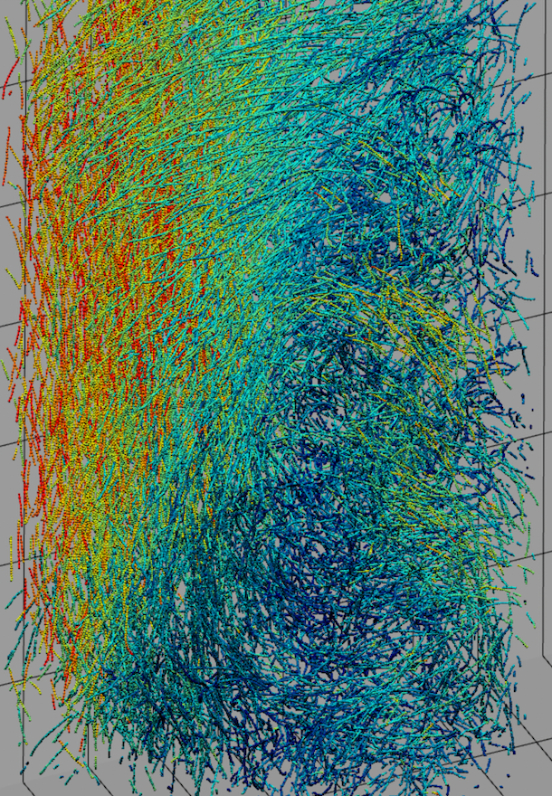

# Pollen over forest canopy flow

## Description
Data analysis of data acquired by 1+ high speed cameras at the wind tunnel in Portland State University. 

## Features
- If the flow is visualized using particle tracking velocimetry, separate pollen particles from tracer particles using "preprocessingAll.m" inside separate_particles folder.  
- Data is imported using "dat_to_filtered_traj.m". This code also filters and conditions the raw signals.
- Pollen trajectories are analyzed in "traj_analysis_TBL.m" and "traj_analysis_turbulence". Standard turbulence quantities are calculated in these codes, such as probability density functions and structure functions.
 
## Screenshots

## Installation
No installation. Download and run on MATLAB.
